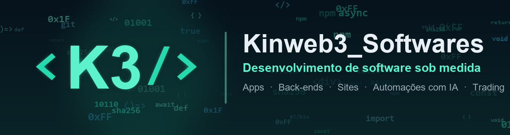
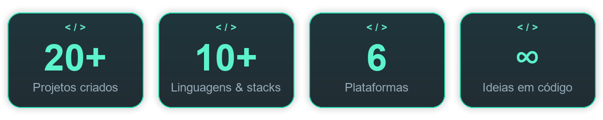
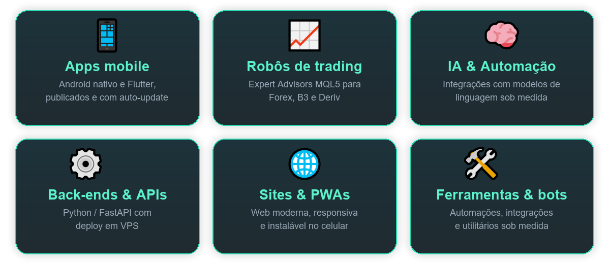

  

<h3 align="center">💻 Transformamos ideias em software que funciona — do zero à publicação.</h3>

Apps · Sistemas · Sites · Automações · Inteligência Artificial · Robôs de Trading

  
  
  

  

---

## 🧰 Stack & Tecnologias

<b>📱 Mobile</b>

  
  
  
  
  

<b>⚙️ Back-end & APIs</b>

  
  
  
  
  

<b>🌐 Web</b>

  
  
  
  
  
  

<b>📈 Trading & Mercado Financeiro</b>

  
  
  
  
  

<b>🧠 IA & Automação</b>

  
  
  
  
  

<b>🛠️ DevOps & Ferramentas</b>

  
  
  
  
  

---

## 🚀 O que a gente constrói

  

> **Se dá pra imaginar em código, a gente constrói.** Descreva a ideia — do protótipo à publicação.

---

## 🧩 Como eu trabalho

  <code>💡 Ideia</code> ➜ <code>📐 Protótipo</code> ➜ <code>⌨️ Desenvolvimento</code> ➜ <code>🧪 Testes</code> ➜ <code>🚀 Publicação</code> ➜ <code>🔄 Atualizações contínuas</code>

---

## 📌 Projeto em destaque

### 📥 [Kinweb3_Downloads](https://github.com/Forextoolssoftwares/Kinweb3_Downloads)
App Android que baixa **vídeo e áudio** de várias redes (YouTube, Instagram, TikTok, X e outros) **direto no celular**, com login do Instagram e **atualização automática** embutida.

---

## 📬 Vamos criar algo juntos?

  <b>Marcos</b> &nbsp;•&nbsp; 📞 55 31 99380-3254

© Direitos reservados a <b>Kinweb3_Softwares</b>

